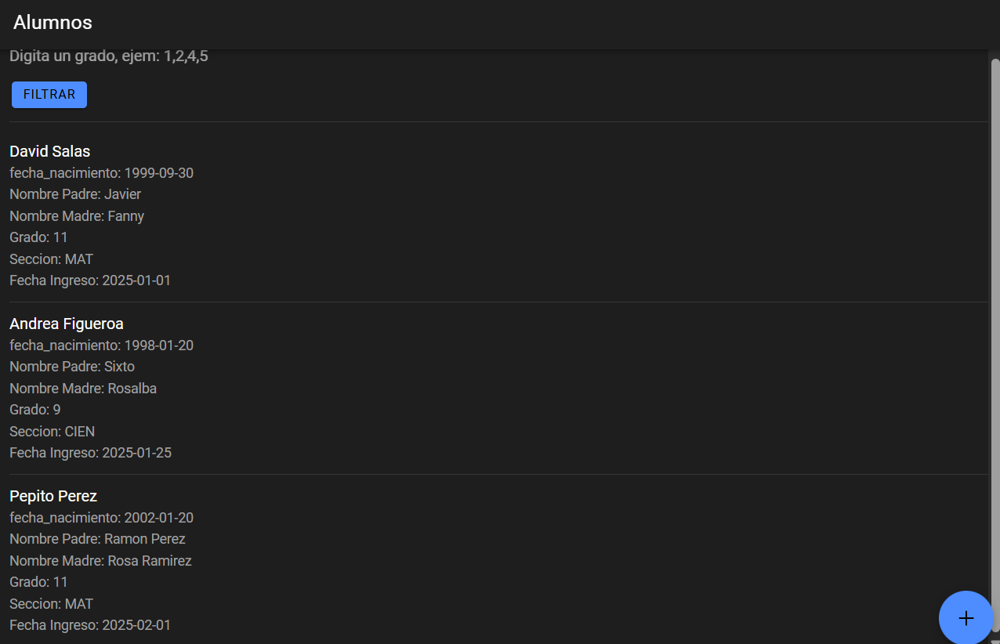
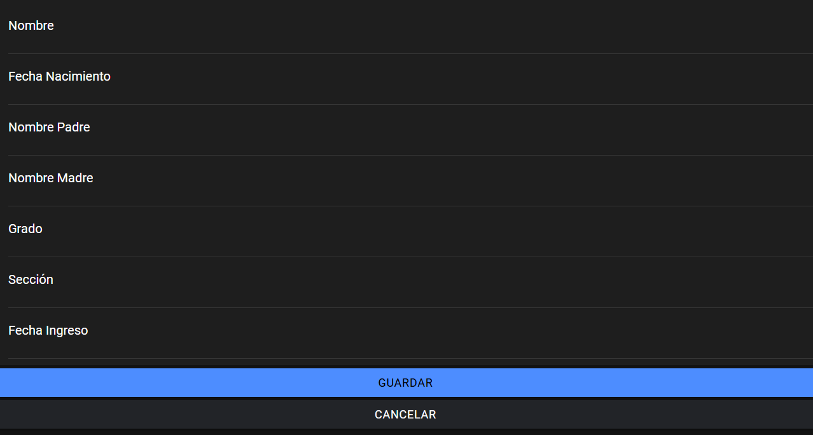
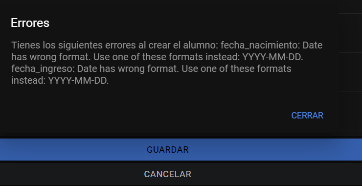
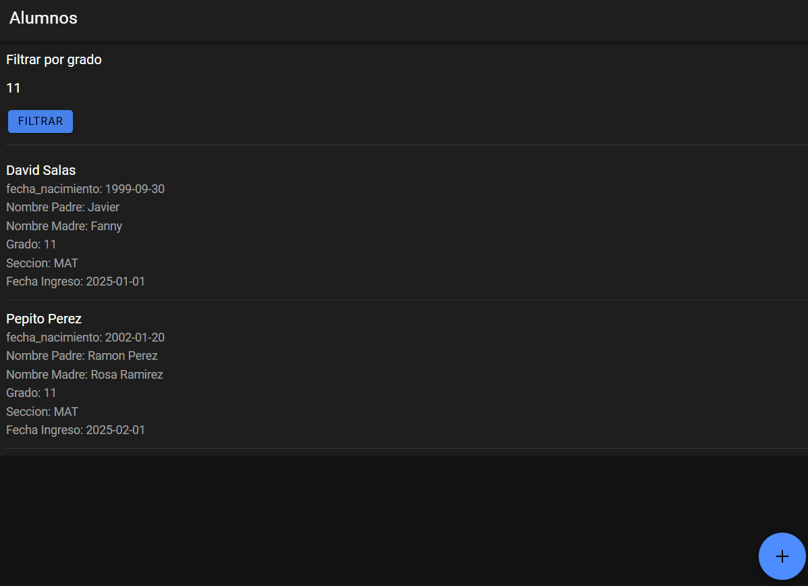
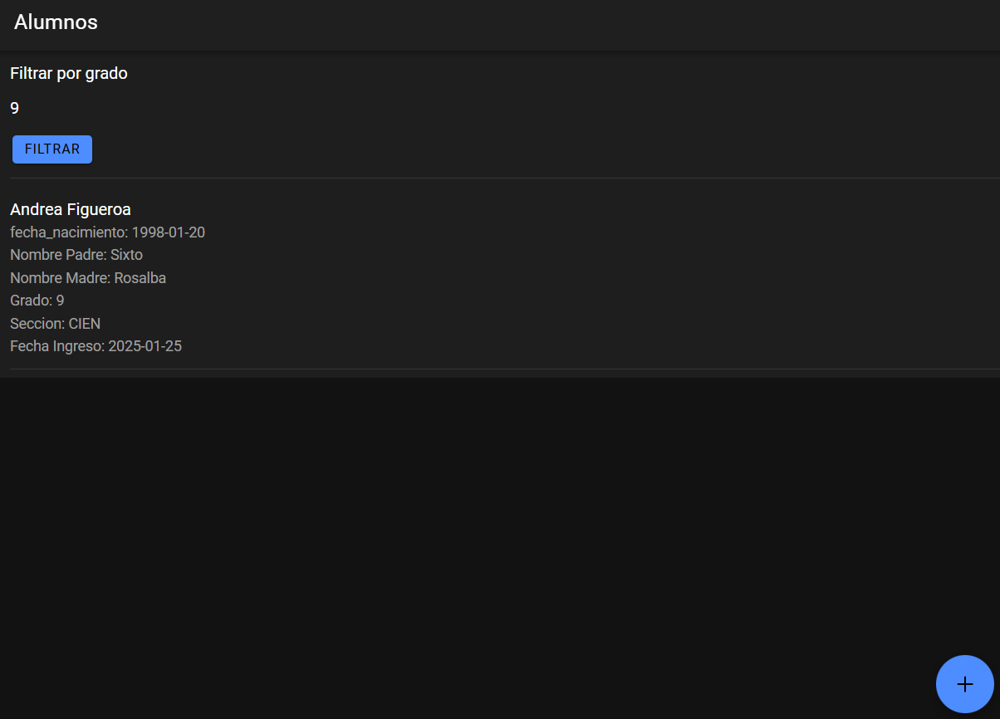

# Documentación prueba tecnica.

Todo el proyecto esta dockerizado, por lo cual para verlo en funcionamiento solo basta clonar el repositorio y correr el siguiente comando:
docker compose up --build
Esto construira los tres contedores necesarios para funcionar:
- mysql_db -> Base de datos MySQL
- djangoapp -> Backend con django que disponibiliza el API de alumnos
- ionic-app -> Aplicación frontend realizada con ionic para web/dispositivos moviles.

## Backend
El backend es un API básico construido con django, el postman de este proyecto se encuentra en la siguiente URL:https://app.getpostman.com/join-team?invite_code=378261ef30a72f7b4910a22e61502eb5b3a5b639ffa44cf13323eaf4f7865195&target_code=220ce48b820bf3fafb88f759a9a5f0c0

## Frontend
El backend de acuerdo a los requerimientos se hizo usando Ionic y Angular.

Esta construido con Nginx en docker por lo cual para accederlo desde el navegador una vez haya corrido sin problemas todos los contedores solo basta con entrar a la ruta raiz disponibilizada: http://localhost:8100/ y el auto redirigirá al home de la aplicación.

# Visualización de funcionamiento

## Home Page, vista de alumnos

## Creation Page, vista de creación

## Control de errores en creación

## Filtrado por grado

¡Muchas gracias por su atención!